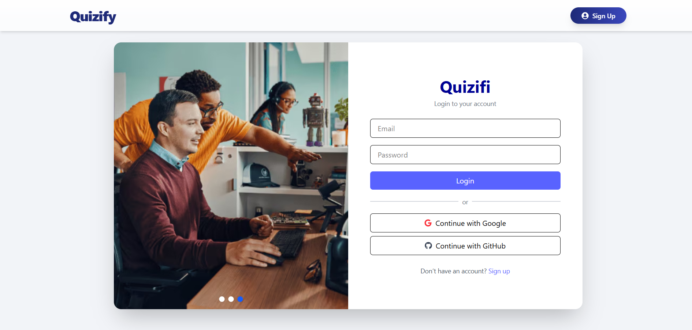
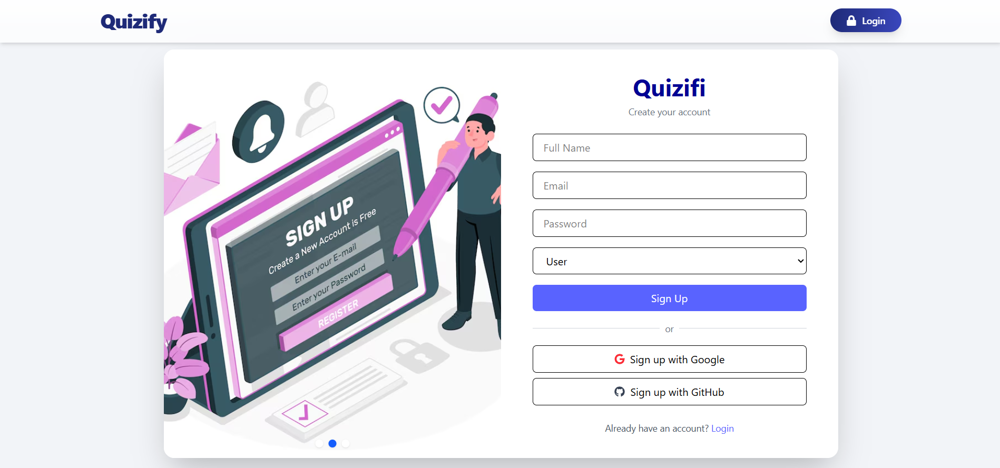
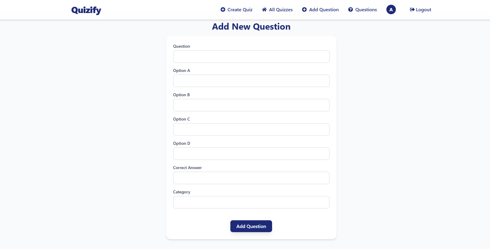
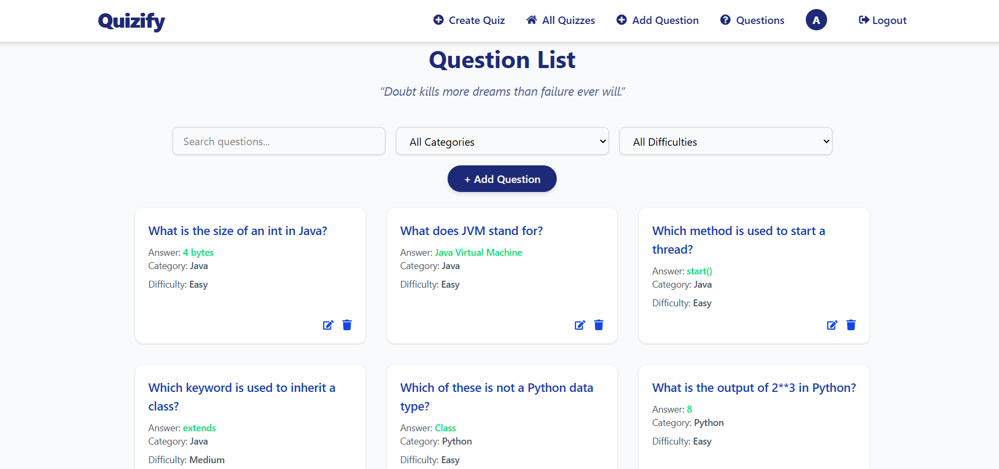
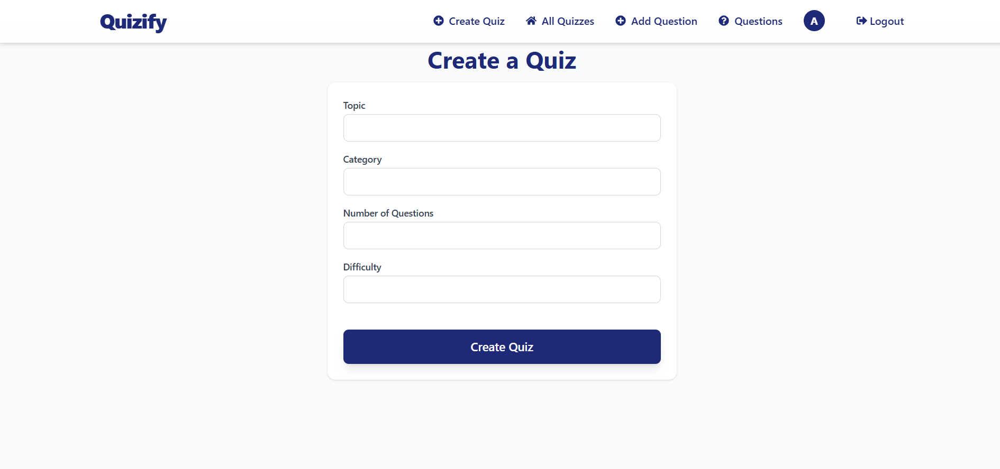
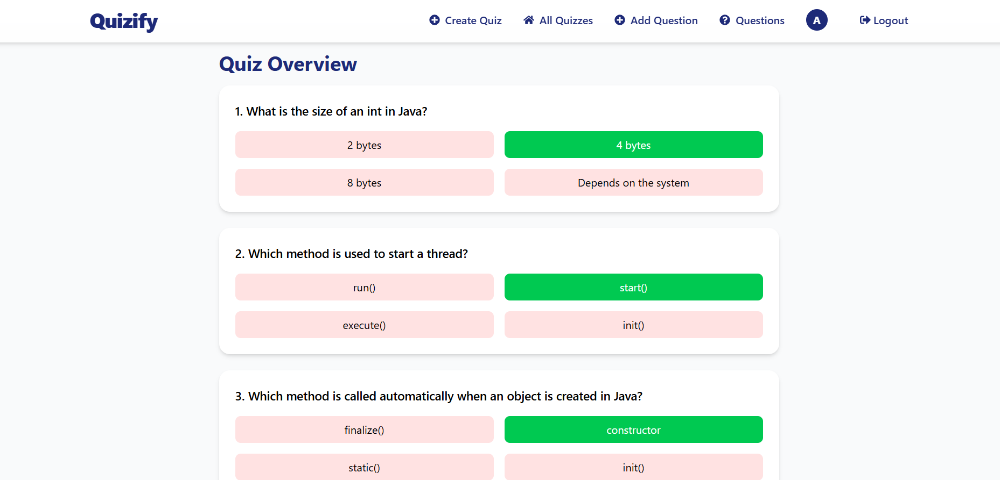

# 🎯 Quizify

**Quizify** is a dynamic full-stack quiz platform that enables users to seamlessly register, log in, take interactive quizzes, and track their scores, while providing admins with robust tools to create, update, and manage quiz content and user data through an intuitive interface.

---

## 🛠️ Tech Stack

<table style="border: none; border-collapse: collapse;">
  <tr>
    <th style="text-align: left; padding: 8px;">Frontend</th>
    <th style="text-align: left; padding: 8px;">Backend</th>
  </tr>
  <tr>
    <td style="padding: 8px;">
      <span style="margin-right: 12px;"></span>
      <span style="margin-right: 12px;"></span>
      <span></span>
    </td>
    <td style="padding: 8px;">
      <span style="margin-right: 12px;"></span>
      <span></span>
    </td>
  </tr>
  <tr>
    <th style="text-align: left; padding: 8px;">Database</th>
    <th style="text-align: left; padding: 8px;">API Tool</th>
  </tr>
  <tr>
    <td style="padding: 8px;">
      <span></span>
    </td>
    <td style="padding: 8px;">
      <span></span>
    </td>
  </tr>
  <tr>
    <th style="text-align: left; padding: 8px;">Version Control</th>
    <th style="text-align: left; padding: 8px;">IDE</th>
  </tr>
  <tr>
    <td style="padding: 8px;">
      <span style="margin-right: 12px;"></span>
      <span></span>
    </td>
    <td style="padding: 8px;">
      <span style="margin-right: 12px;"></span>
      <span></span>
    </td>
  </tr>
</table>

---

## 🧠 Features

### 👥 User
- Register and log in
- Browse available quizzes
- Attempt quizzes
- View results and scores

### 🛡️ Admin
- Add, edit, delete questions
- Create and manage quizzes

---

## 🌐 Application Routes

| Route               | Access        | Component      |
| ------------------- | ------------- | -------------- |
| `/`                 | Public        | `Home`         |
| `/login`            | Public        | `LoginForm`    |
| `/signup`           | Public        | `SignupForm`   |
| `/quizzes`          | Authenticated | `QuizList`     |
| `/quiz/:id`         | Authenticated | `TakeQuiz`     |
| `/result/:id`       | Authenticated | `QuizResult`   |
| `/questions`        | Admin         | `AllQuestions` |
| `/add-question`     | Admin         | `AddQuestion`  |
| `/editQuestion/:id` | Admin         | `EditQuestion` |

---

## 🚀 Getting Started

### 📦 Backend Setup (Spring Boot + PostgreSQL)

**Prerequisites:**
- Java 21
- PostgreSQL
- Maven

**Setup:**

Update `src/main/resources/application.properties`:
   ```properties
   spring.datasource.url=jdbc:postgresql://localhost:5432/quizify_db
   spring.datasource.username=your_db_username
   spring.datasource.password=your_db_password
   spring.jpa.hibernate.ddl-auto=update
````
Run the server:

   ```bash
   cd backend
   mvn spring-boot:run
   ```

   → App runs at `http://localhost:8080`

**Key Dependencies:**
`spring-boot-starter-web`, `data-jpa`, `postgresql`, `lombok`, `devtools`

---

### 💻 Frontend Setup (React + Vite + Tailwind)

**Prerequisites:**

* Node.js v18+
* npm / yarn

**Setup:**

```bash
cd client
npm install
npm run dev
```

→ Frontend runs at `http://localhost:5173`

**Key Libraries:**
`react`, `react-router-dom`, `axios`, `tailwindcss`, `react-toastify`, `vite`


---
## 🖼️ Screenshots

### 🔐 Login  
<ul>
  <li>The login page allows registered users to securely access their accounts.</li>
  <li>Includes form validation and error messages for incorrect credentials.</li>
</ul>



### 📝 Signup  
<ul>
  <li>New users can create an account by providing their details on this signup page.</li>
  <li>The form ensures required fields are completed before submission.</li>
</ul>



### 🖼️ Landing Page  
<ul>
  <li>The Landing Page welcomes Students & Admins and provides quick access to quizzes.Users navigate to quizzes, results, and other available features here.</li>
  <li>Encourages visitors to register or log in to start using Quizify.</li>
</ul>


### ➕ Create Question  
<ul>
  <li>Admins can add new questions with multiple choice answers and categories.</li>
  <li>Includes validation to ensure each question is complete and accurate.</li>
</ul>



### 📄 Question List  
<ul>
  <li>Admin panel for managing all quiz questions with options to edit or delete.</li>
  <li>Allows filtering questions by category to streamline content management.</li>
</ul>



### 🧩 Create Quiz  
<ul>
  <li>Admins can create new quizzes by setting the title, description, and questions.</li>
  <li>This interface simplifies adding quizzes tailored to different topics.</li>
</ul>



### 📊 Quiz Overview  
<ul>
  <li>Displays a list of available quizzes with categories and difficulty levels.</li>
  <li>Users can browse and select quizzes to attempt from this overview.</li>
</ul>



---

## 📄 License

This project is licensed under the [MIT License](LICENSE).

---
